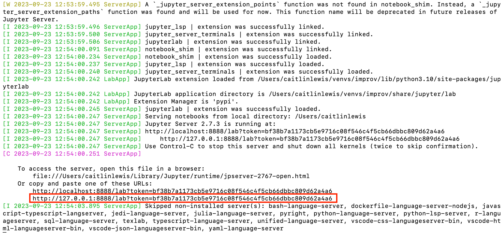

Installation
============

``animal-soup`` uses `Docker <https://www.docker.com/>`_ to create an isolated environment for using the package. The instructions below walk
through a detailed installation process.

Step 1
******

Install `Docker Desktop <https://www.docker.com/products/docker-desktop/>`_.

As stated above, ``Docker`` creates an isolated environment to run ``animal-soup`` in. This will make sure that the proper packages for using
your machines' GPU(s) are installed and do **NOT** conflict with existing software or environments on your machine. The following image summarizes
what a ``Docker`` environment does.

The ``Docker`` container will be running in an isolated environment on your local host machine. We will bind a port on your local machine to the container
in order to run jupyter lab. We will also mount your behavioral data on your local file system so that it can be accessed from within the container.

In the subsequent steps, you will install ``animal-soup`` by building a ``Docker`` image and then running a ``Docker`` container based on
the ``animal-soup`` image.

Step 2
******

Clone the ``animal-soup`` repo.

.. code-block:: python

    # clone the repo
    git clone https://github.com/hantman-lab/animal-soup.git
    # navigate into the repo
    cd animal-soup

Step 3
******

Build the ``Docker`` image for ``animal-soup``.

.. code-block:: python

    docker build -t ansoup .

This will build a ``Docker`` image. A ``Docker`` image is simply the set of instructions to build a ``Docker`` container. It contains all the relevant
packages needed to run ``animal-soup``.

.. note::
    The ``-t`` flag allows you to "tag" your image with a name. For simplicity, I have named the image `ansoup`; however it could theoretically be anything
    you want. You will just need to use the same image name when you go to run the container.

Building the ``Docker`` image may take a few minutes. However, you will only need to build the image once. You are essentially creating an isolated
environment, and then to use ``animal-soup`` you will simply "run" the image in a container.

Step 4
******

Start a ``Docker`` container to run the image.

.. code-block:: python

    docker run --gpus all -w /animal-soup -it --rm -p 8888:8888 -v /home:/home ansoup

The various flags do the following:

- ``--gpus all`` gives access to all of your machines' GPUs
- ``-w /animal-soup`` sets the working directory when the container opens, by default I have set this to be the repo that is in the container
- ``-it`` allows there to be an active terminal session within the container
- ``-p`` is used for binding local ports on your host machine to container ports, this will be necessary to for launching a jupyter lab server and viewing it on your local machine
- ``-v /home:/home`` is used for volume mounting; because the container does not have access to your local file system, where your behavioral data is stored, you will need to mount the file system to access it within your container

.. note::
    Here I am mounting ``/home:/home`` because these instructions were developed on a Linux machine. However, you should change the mount paths to be relevant
    to your machine. If you are on Windows, you could mount a C drive like so: ``-v /C:/C``

.. note::
    You can mount more than one volume by simply adding additional ``-v /path/on/local/host:/container/file/structure``. The host files that you are mounting need
    to be written as the path appears on your local machine, but you can create whatever path you would like to get to those files in the container. For example, if
    I wanted to mount my `data` directory under a folder called `behavioral_data`: ``-v /data/caitlin:/behavioral_data/``

Step 5
******

Once you have the container running, try running the tests to make sure everything is working properly.

.. code-block:: python

    # you need to be in the animal-soup repo, you can `cd` here if you did not set your working directory as `animal-soup`
    pytest -s tests

If the tests are not passing, please post an issue on the repo so that I can help!

Step 6
******

If the tests have passed, the next thing to do is launch a jupyter lab server and start using ``animal-soup``!

.. code-block:: python

    jupyter lab --allow-root --ip=0.0.0.0 --no-browser

This will start a jupyter lab terminal within the container. However, because we binded the local host port 8888 to the container port 8888.
You can then launch your preferred browser and access the jupyter lab server running at ``localhost:8888``.

.. note::
    When you launch jupyter lab, it will give ask for a token. You can get the token from the terminal where you launched jupyter lab.

**Example Token**

.. note::
    A running docker container **WILL NOT** save changes across different runnings of the container.
    This means that when you stop the docker container instance any changes made to files in the docker environment will not persist
    when you run the docker container again. However, this **DOES NOT** apply to mounted files. By default your behavior prediction will be
    saved under your ``parent_data_path`` that you set before running inference. The ``parent_data_path`` will be located under the mounted file
    volume so this will not be an issue. You just need to make sure any jupyter notebooks that you want saved are located under the mounted file
    volume and **NOT** in the filesystem of the container!
